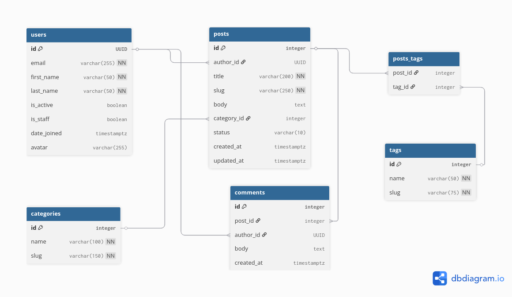

# blog-api
### Entity Relation Diagram


## Installation and Setup

### 1. Clone repository
```bash
git clone https://github.com/smileBlueRose/blog-api
cd blog-api
```

### 2. Rename secret files
```bash
cd secrets
mv django_secret_key.example django_secret_key
mv db_password.example db_password
mv jwt-private.pem.example jwt-private.pem
mv jwt-public.pem.example jwt-public.pem
mv redis_password.example redis_password
cd ..
```
### 3. Run docker compose
```bash
sudo docker compose --env-file env_files/.env.template up -d
```

### 4. Install dependencies
```bash
cd blog_api
uv sync
```

### 5. Run server
```bash
uv run manage.py migrate
uv run manage.py runserver
```

## Comments

### Why I have chosen cache_page?
I decided to use `cache_page()` because it seems to me to be more flexible. It automatically takes into account the entered query parameters and caches them based on the unique url. Without this, I would have to manually check which query parameters user entered and save different results from views to the redis.
